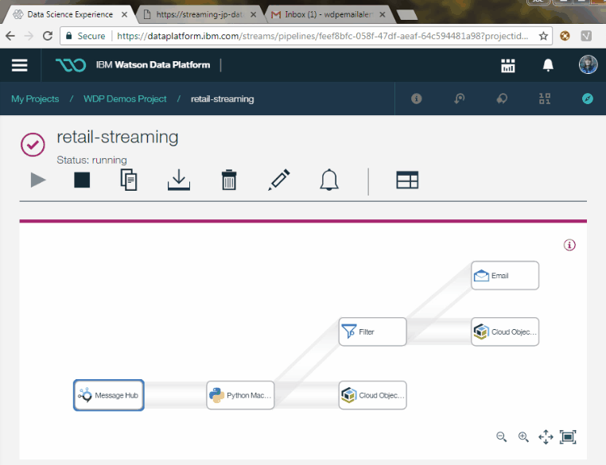
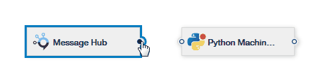

# Introduction

The purpose of this project is to create a Streams Designer application that listens to the event stream generated by the project [kafka-producer-for-simulated-data](https://github.com/ibm-cloud-streaming-retail-demo/kafka-producer-for-simulated-data) and apply a python machine learning model to score each purchase line item for the probability that the line item will be cancelled.

# Dependencies

- This project has a dependency on the [kafka-producer-for-simulated-data](https://github.com/ibm-cloud-streaming-retail-demo/kafka-producer-for-simulated-data) project being deployed

# Prerequisites

- You have followed the instructions to deploy the project [kafka-producer-for-simulated-data](https://github.com/ibm-cloud-streaming-retail-demo/kafka-producer-for-simulated-data)
- You have an IBM Cloud account
- Recommended learning: 
  - https://developer.ibm.com/clouddataservices/docs/streams-designer/
  - https://developer.ibm.com/clouddataservices/docs/ibm-data-science-experience/
  - https://datascience.ibm.com/docs/content/streaming-pipelines/python_machine_learning.html
  
# Deploy

## Build the machine learning model

In this step we run the notebook [LogisticRegressionModel.ipynb](./LogisticRegressionModel.ipynb).  This notebook creates a very basic LogisticRegression model that classifies purchase line items for their likelihood to be cancelled.

Streams Designer requires the LogisicRegression model to be created with the same versions of python that are available in the Streams environment.  To make setting up the environment easy, we use [DSX](http://datascience.ibm.com).  Import the notebook into DSX, change the variables to point to your COS S3 bucket where you want to upload the model to and then run all of the cells to build the model and deploy it to COS S3.

## Deploy the Streams flow

In this section we walk step-by-step through setting up the Streams environment.

The overall streams flow looks like this:

<div style="width:50%">

</div>

- **Message Hub** Our events arrive into our streaming application via IBM Message Hub
- **Python Machine Learning** Each event is scored for their probability of being cancelled using a Logistic Regression machine learning model
- **Filter** Events that have a probability <65% are ignored.  The rest are sent to the SMTP endpoint.
- **SMTP** The SMTP sends an email containing the event details.
- **COS S3** Events are also persisted to COS S3 for an audit trail and offline analysis

### Message Hub source setup

From the 'Sources' node group, drag and drop the Message Hub node onto the canvas. In the settings on the right hand side, click 'Add Connection'.  If you are connection to a Message Hub instance provisioned in your IBM Cloud account, selecting the instance will automatically populate form with the connection credentials.  Else, select 'IBM Message Hub', and copy and paste the Connection Details from the 'Service Credentials' tab of the Message Hub instance you wish to connect to.

Select the Topic 'transactions_load' from the Topic dropdown.  Click 'Edit Schema', then 'Detect Schema' to automatically generate the schema for the incoming data. Click 'Save' then 'Close'.

### Python Machine Learning setup

From the 'Processing and Analytics' node group, drag and drop the 'Python Machine Learning' node onto the canvas. In the settings of this node under 'File Objects', enter a File Reference Name e.g. 'logistic_model', add a connection to your IBM COS, and the file path to the Machine Learning model you built in the 'Build the machine learning model' section. You can enter the path manually, or locate it in the GUI by clicking the 'Select Data Asset' button to the right of this text field.

Copy and paste the below code into the 'Code' section, selecting Python 3.5 as the language:
```
import sys
import os
import pickle
import numpy as np
import sklearn
import pandas as pd
from collections import OrderedDict

def process(event, state):
    
    transaction_id = event['TransactionID']
    tx_datetime = event['InvoiceDate']
    
    customer_id = event['CustomerID']
    quantity = event['Quantity']
    price = event['UnitPrice']
    
    data = np.array([[price, quantity, customer_id]])
    
    predict_prob = state['logistic_model'].predict_proba(data)
    
    prob_cancelled = predict_prob[0][1]
    
    prediction =  OrderedDict([    
            ('transaction_id', transaction_id),
            ('invoice_date',   tx_datetime),
            ('prob_cancelled', prob_cancelled)
            ])
            
    return prediction


def load_logistic_model(state, path_logistic_model):
	state['logistic_model'] = pickle.load(open(path_logistic_model, 'rb'))
```

TODO Data Schema

Finally, connect the two nodes by drawing a line from one to the other on the canvas.

<div style="width:50%">

</div>


### Filter setup

From the 'Processing and Analytics' node group, drag and drop the 'Filter' node onto the canvas. In the settings of the node, paste the below code into the condition expression:
```
prob_cancelled >= 0.65
```
You can learn more about filter expressions in [the documentation](https://dataplatform.ibm.com/docs/content/streaming-pipelines/filter.html)

### SMTP setup

TODO

### COS S3 setup

TODO

## Monitoring the streams flow

TODO

# Simulating a risky transaction

TODO describe how to do this and how to see it flow through to email
