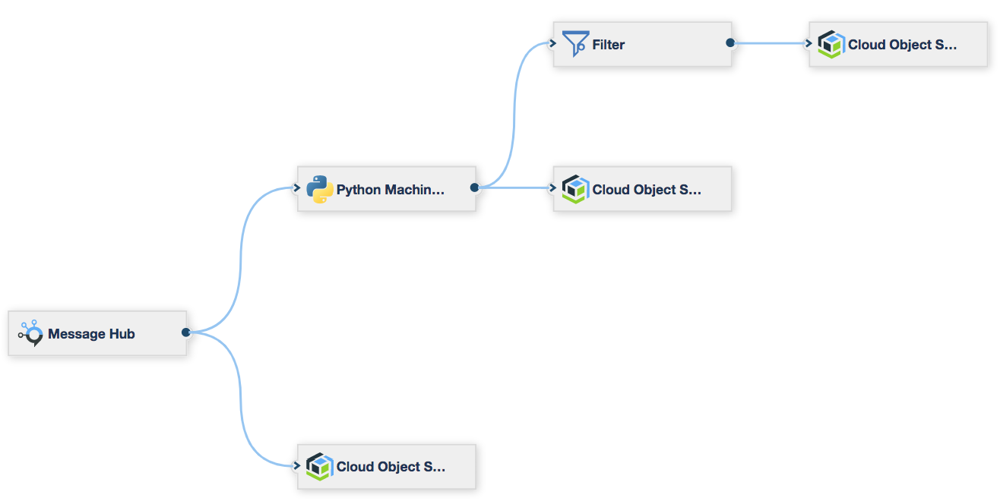

# Introduction

The purpose of this project is to create a stream designer application that listens to the event stream generated by the project [kafka-producer-for-simulated-data](https://github.com/ibm-cloud-streaming-retail-demo/kafka-producer-for-simulated-data) and apply a python machine learning model to score each purchase line item for the probability that the line item will be cancelled.

# Dependencies

- This project has a dependency on the [kafka-producer-for-simulated-data](https://github.com/ibm-cloud-streaming-retail-demo/kafka-producer-for-simulated-data) project being deployed

# Prerequisites

- You have followed the instructions to deploy the project [kafka-producer-for-simulated-data](https://github.com/ibm-cloud-streaming-retail-demo/kafka-producer-for-simulated-data)
- You have an IBM Cloud account
- Recommended learning: 
  - https://developer.ibm.com/clouddataservices/docs/streams-designer/
  - https://developer.ibm.com/clouddataservices/docs/ibm-data-science-experience/
  - https://datascience.ibm.com/docs/content/streaming-pipelines/python_machine_learning.html
  
# Deploy

## Build the machine learning model

In this step we run the notebook [LogisticRegressionModel.ipynb](./LogisticRegressionModel.ipynb).  This notebook creates a very basic LogisticRegression model that classifies purchase line items for their likelihood to be cancelled.

Streams Designer requires the LogisicRegression model to be created with the same versions of python that are available in the streams environment.  To make setting up the environment easy, we use DSX.  Import the notebook into DSX, change the variables to point to your COS S3 bucket where you want to upload the model to and then run all of the cells to build the model and deploy it to COS S3.

## Deploy the streams flow

In this section we walk step-by-step through setting up the Streams environment.

The overall streams flow looks like this (TODO replace with Joe's image):

- **Message Hub** Our events arrive into our streaming application via. IBM Message Hub
- **Python Machine Learning** Each event is scored for their probability of being cancelled using a Logistic Regression machine learning model
- **Filter** Events that have a probability <70% are ignored.  The rest are sent to the SMTP endpoint
- **SMTP** The SMTP sends an email containing the event details.
- **COS S3** Events are also persisted to COS S3 for an audit trail and offline analysis

### Message Hub source setup

TODO

### Python Machine Learning setup

TODO

### Filter setup

TODO

### SMTP setup

TODO

### COS S3 setup

TODO

## Monitoring the streams flow

TODO

# Simulating a risky transaction

TODO describe how to do this and how to see it flow through to email
